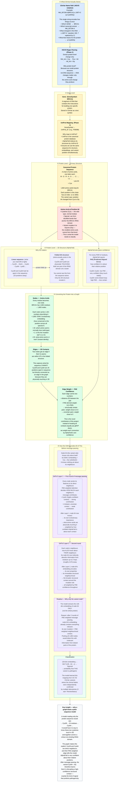

# Biological Hierarchy: From ClinVar Variant Name to GNN Encoding

Paste the code block below into https://mermaid.live to render.

```mermaid
flowchart TD

    %% ─── LEVEL 0: RAW CLINVAR RECORD ────────────────────────────────────
    subgraph L0["① What ClinVar Actually Stores"]
        direction TB
        RAW["<b>ClinVar Name field  (HGVS notation)</b><br/>Example: NM_007294.4(BRCA1):c.190T>C (p.Cys64Gly)<br/><br/>This single string encodes four things at once:<br/>• Which GENE  →  BRCA1<br/>• Which transcript version  →  NM_007294.4<br/>• What changed in the DNA  →  c.190T>C  (position 190, T replaced by C)<br/>• What that means for the protein  →  p.Cys64Gly"]
        PARSE["<b>HGVS Regex Parsing  (Phase 1)</b><br/>Extract protein-level change only:<br/>Ref_AA = Cys  ·  Pos = 64  ·  Alt_AA = Gly<br/><br/>Why protein level? Because we model protein structure,<br/>not DNA sequence — DNA changes matter only through<br/>the amino acid change they produce"]
        RAW --> PARSE
    end

    %% ─── LEVEL 1: GENE ──────────────────────────────────────────────────
    subgraph L1["② Gene Level"]
        direction TB
        GENE["<b>Gene  (GeneSymbol: BRCA1)</b><br/>A segment of DNA that contains the instructions<br/>for building one specific protein.<br/>Stored in ClinVar as a text symbol."]
        UNIPROT["<b>UniProt Mapping  (Phase 1)</b><br/>GeneSymbol → UniProt_ID  (e.g., P38398)<br/><br/>Why map to UniProt?<br/>• UniProt is the canonical protein database<br/>• AlphaFold indexes its structures by UniProt ID<br/>• Ensures we use the same sequence for structure,<br/>  embeddings, and variant position simultaneously"]
        GENE --> UNIPROT
    end

    PARSE --> GENE

    %% ─── LEVEL 2: PROTEIN SEQUENCE ──────────────────────────────────────
    subgraph L2["③ Protein Level  —  Primary Structure"]
        direction TB
        SEQ["<b>Canonical Protein Sequence</b><br/>A chain of amino acids, one letter each:<br/>M - G - R - A - S - ... - C - ... - G - ...<br/>                              ↑ pos 64 = Cys<br/><br/>1,863 amino acids long for BRCA1<br/>Each position in this chain has an index  (1 to 1863)<br/>The variant says: position 64 changed from Cys to Gly"]
        AA["<b>Amino Acid at Position 64</b><br/>• Cysteine (Cys) — the wild-type, normal residue<br/>• Special: can form disulfide bonds that<br/>  anchor the BRCA1 RING domain<br/>• Variant mutates it to Glycine (Gly) —<br/>  the smallest amino acid, cannot form that bond<br/>→ This is what the model needs to classify"]
        SEQ --> AA
    end

    UNIPROT --> SEQ

    %% ─── LEVEL 3: 3D STRUCTURE ───────────────────────────────────────────
    subgraph L3["④ Protein Level  —  3D Structure  (AlphaFold)"]
        direction LR

        subgraph FOLD["Why 3D matters"]
            F1["<b>Linear sequence</b>  (what you read left to right):<br/>... Cys39 ... His41 ... Cys61 - Cys64 - Lys65 ...<br/><br/>Cys39 and Cys64 look far apart in the sequence<br/>(25 positions away)"]
            F2["<b>Folded 3D structure</b>  (what actually exists in the cell):<br/>Cys39 and Cys64 are physically TOUCHING<br/>Both are part of the RING domain zinc cluster<br/><br/>You cannot see this from the sequence alone.<br/>Only the 3D structure reveals it."]
            F1 -->|"protein folds up"| F2
        end

        subgraph PAE_BOX["AlphaFold also gives confidence"]
            P1["For every PAIR of residues, AlphaFold reports<br/><b>PAE (Predicted Aligned Error)</b>:<br/>how confident it is about their relative position<br/><br/>Cys64–Cys61: low PAE → very confident (they touch stably)<br/>Cys64–some distant loop: high PAE → less certain"]
        end
    end

    AA --> FOLD
    AA --> PAE_BOX

    %% ─── LEVEL 4: GRAPH REPRESENTATION ──────────────────────────────────
    subgraph L4["⑤ Converting the Protein into a Graph"]
        direction TB
        NODES["<b>Nodes  =  Amino Acids</b><br/>Every residue becomes one node.<br/>BRCA1 has 1,863 residues → 1,863 nodes.<br/><br/>Each node carries 1,321 numbers describing it:<br/>• 1280: ESM-2 evolutionary embedding<br/>  (how conserved is this position across all species?)<br/>• 20: which amino acid is normally here (wild-type)<br/>• 1: is this the mutation site? (1 or 0)<br/>• 20: what amino acid is it now? (mutant identity)"]
        EDGES["<b>Edges  =  3D Contacts</b><br/>Two nodes get an edge if their Cα atoms<br/>are within 8 Å in the folded structure.<br/><br/>This captures what the sequence CANNOT:<br/>Cys39 and Cys64 are 25 positions apart in sequence<br/>but directly connected as an edge in the graph<br/>because they are physically touching in 3D"]
        EATTR["<b>Edge Weight  =  PAE Confidence</b><br/>Each edge carries two numbers:<br/>• distance (Å) between the pair<br/>• PAE-derived weight: 1/(1+PAE)<br/>  → structurally certain pairs: weight close to 0.5<br/>  → uncertain pairs: weight close to 0<br/><br/>This is the novel contribution of this project:<br/>instead of treating all contacts equally (as gMVP does),<br/>we weight each connection by AlphaFold's own confidence"]
        NODES --> EDGES --> EATTR
    end

    FOLD --> NODES
    PAE_BOX --> EATTR

    %% ─── LEVEL 5: GNN ENCODING ──────────────────────────────────────────
    subgraph L5["⑥ How the GNN Encodes All of This"]
        direction TB

        subgraph BEFORE["Before message passing"]
            B1["Node 64 (the variant site) knows only about itself:<br/>its ESM-2 embedding + Cys→Gly substitution<br/>It knows nothing yet about its neighbours"]
        end

        subgraph LAYER1["GATv2 Layer 1  —  First round of message passing"]
            L1A["Every node sends its features to its direct neighbours<br/>PAE-weighted attention decides HOW MUCH each neighbour's<br/>message contributes:<br/>• Cys61 (highly confident contact) → strong contribution<br/>• A distant, uncertain contact → weak contribution<br/><br/>After Layer 1, node 64 now 'knows':<br/>→ its own evolutionary importance<br/>→ what amino acids are physically touching it<br/>→ weighted by how confident AlphaFold is about each contact"]
        end

        subgraph LAYER2["GATv2 Layer 2  —  Second round"]
            L2A["Each node's neighbours now ALSO know about THEIR neighbours<br/>So node 64 now indirectly absorbs information from<br/>residues up to 2 hops (roughly 16 Å) away<br/><br/>After Layer 2, node 64's embedding encodes:<br/>→ its own properties<br/>→ its immediate structural neighbourhood<br/>→ the broader structural context around the mutation site<br/>→ all weighted by PAE confidence throughout"]
        end

        subgraph READOUT["Readout  —  Why only the variant node?"]
            L3A["The model extracts the 128-dim embedding of node 64 ONLY<br/>(not the whole protein)<br/><br/>Reason: after 2 rounds of PAE-weighted message passing,<br/>node 64's embedding already contains everything relevant:<br/>its own mutation + PAE-weighted neighbourhood context.<br/>Pooling all 1,863 nodes would dilute this with irrelevant<br/>information from distant parts of the protein."]
        end

        subgraph PRED["Classification"]
            L4A["128-dim embedding → MLP (128→64→1) → Sigmoid<br/>→ probability that THIS variant is pathogenic<br/><br/>The model learned this mapping from 34,732 ClinVar variants<br/>where the clinical labels were independently confirmed<br/>by multiple laboratories (2-star+ ReviewStatus)"]
        end

        BEFORE --> LAYER1 --> LAYER2 --> READOUT --> PRED
    end

    EATTR --> BEFORE

    %% ─── WHY GRAPH > SEQUENCE ─────────────────────────────────────────
    NOTE["<b>Key insight — why a graph beats a plain sequence model</b><br/><br/>A model reading only the protein sequence would see:<br/>... Cys39 ... 24 residues ... Cys64 ...<br/>It would have no way to know these two cysteines touch in 3D<br/>and together anchor a critical zinc-binding RING domain.<br/><br/>The graph makes this explicit: Cys39 and Cys64 are direct neighbours,<br/>and their PAE-weighted edge tells the model<br/>AlphaFold is very confident about their relative positions.<br/>After message passing, the variant Cys64→Gly therefore learns<br/>that it is disrupting a high-confidence structural contact —<br/>exactly the kind of signal that predicts pathogenicity."]

    PRED --> NOTE

    %% ─── STYLING ─────────────────────────────────────────────────────
    style RAW fill:#dbeafe,stroke:#2563eb,color:#000
    style PARSE fill:#dbeafe,stroke:#2563eb,color:#000
    style GENE fill:#fef3c7,stroke:#d97706,color:#000
    style UNIPROT fill:#fef3c7,stroke:#d97706,color:#000
    style SEQ fill:#fef3c7,stroke:#d97706,color:#000
    style AA fill:#fee2e2,stroke:#dc2626,color:#000
    style NODES fill:#dcfce7,stroke:#16a34a,color:#000
    style EDGES fill:#dcfce7,stroke:#16a34a,color:#000
    style EATTR fill:#dcfce7,stroke:#16a34a,color:#000
    style LAYER1 fill:#f3e8ff,stroke:#9333ea,color:#000
    style LAYER2 fill:#f3e8ff,stroke:#9333ea,color:#000
    style READOUT fill:#f3e8ff,stroke:#9333ea,color:#000
    style PRED fill:#ecfdf5,stroke:#059669,color:#000
    style NOTE fill:#f8fafc,stroke:#64748b,color:#000
```
