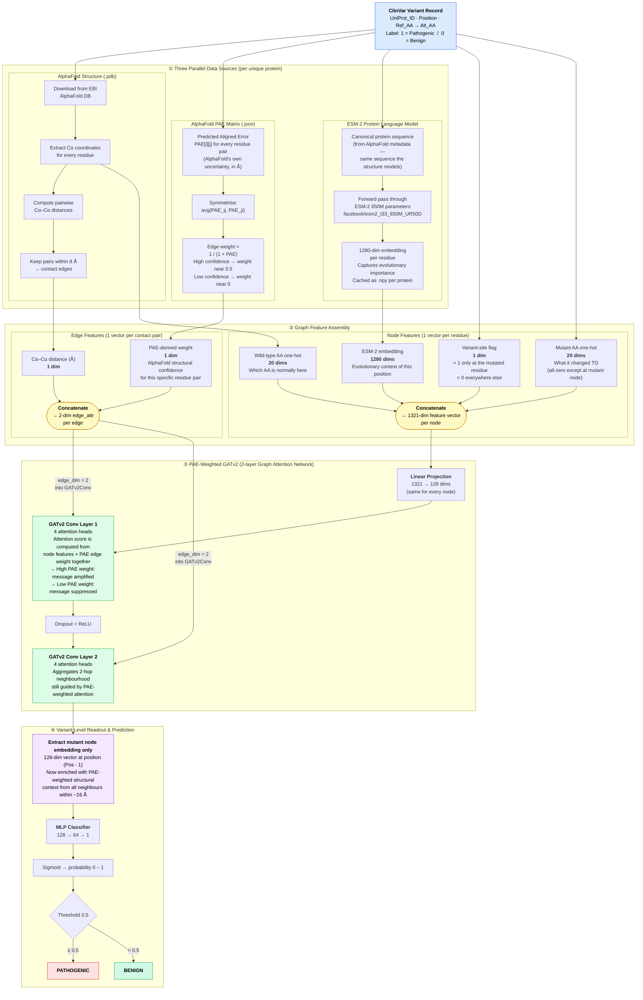

# Model Architecture: PAE-Weighted GATv2 for Missense Variant Pathogenicity

Paste the code block below into https://mermaid.live to render.

```mermaid
flowchart TD
    %% ─── INPUT ───────────────────────────────────────────────────────────
    CV["<b>ClinVar Variant Record</b><br/>UniProt_ID · Position · Ref_AA → Alt_AA<br/>Label: 1 = Pathogenic  /  0 = Benign"]

    %% ─── THREE PARALLEL DATA SOURCES ────────────────────────────────────
    subgraph SRC["① Three Parallel Data Sources (per unique protein)"]
        direction LR

        subgraph APDB["AlphaFold Structure  (.pdb)"]
            A1["Download from EBI<br/>AlphaFold DB"]
            A2["Extract Cα coordinates<br/>for every residue"]
            A3["Compute pairwise<br/>Cα–Cα distances"]
            A4["Keep pairs within 8 Å<br/>→ contact edges"]
            A1 --> A2 --> A3 --> A4
        end

        subgraph APAE["AlphaFold PAE Matrix  (.json)"]
            B1["Predicted Aligned Error<br/>PAE[i][j] for every residue pair<br/>(AlphaFold's own uncertainty, in Å)"]
            B2["Symmetrise:<br/>avg(PAE_ij, PAE_ji)"]
            B3["Edge weight =<br/>1 / (1 + PAE)<br/>High confidence → weight near 0.5<br/>Low confidence → weight near 0"]
            B1 --> B2 --> B3
        end

        subgraph AESM["ESM-2 Protein Language Model"]
            C1["Canonical protein sequence<br/>(from AlphaFold metadata —<br/>same sequence the structure models)"]
            C2["Forward pass through<br/>ESM-2 650M parameters<br/>facebook/esm2_t33_650M_UR50D"]
            C3["1280-dim embedding<br/>per residue<br/>Captures evolutionary importance<br/>Cached as .npy per protein"]
            C1 --> C2 --> C3
        end
    end

    CV --> A1
    CV --> B1
    CV --> C1

    %% ─── NODE & EDGE FEATURE ASSEMBLY ───────────────────────────────────
    subgraph BUILD["② Graph Feature Assembly"]
        direction TB

        subgraph NF["Node Features  (1 vector per residue)"]
            N1["ESM-2 embedding<br/><b>1280 dims</b><br/>Evolutionary context of this position"]
            N2["Wild-type AA one-hot<br/><b>20 dims</b><br/>Which AA is normally here"]
            N3["Variant-site flag<br/><b>1 dim</b><br/>= 1 only at the mutated residue<br/>= 0 everywhere else"]
            N4["Mutant AA one-hot<br/><b>20 dims</b><br/>What it changed TO<br/>(all-zero except at mutant node)"]
            N5(["<b>Concatenate</b><br/>→ 1321-dim feature vector<br/>per node"])
            N1 --> N5
            N2 --> N5
            N3 --> N5
            N4 --> N5
        end

        subgraph EF["Edge Features  (1 vector per contact pair)"]
            E1["Cα–Cα distance (Å)<br/><b>1 dim</b>"]
            E2["PAE-derived weight<br/><b>1 dim</b><br/>AlphaFold structural confidence<br/>for this specific residue pair"]
            E3(["<b>Concatenate</b><br/>→ 2-dim edge_attr<br/>per edge"])
            E1 --> E3
            E2 --> E3
        end
    end

    C3 --> N1
    A2 --> N2
    CV --> N3
    CV --> N4
    A4 --> E1
    B3 --> E2

    %% ─── GATv2 MODEL ─────────────────────────────────────────────────────
    subgraph GNN["③ PAE-Weighted GATv2  (2-layer Graph Attention Network)"]
        direction TB
        P["<b>Linear Projection</b><br/>1321 → 128 dims<br/>(same for every node)"]
        G1["<b>GATv2 Conv Layer 1</b><br/>4 attention heads<br/>Attention score is computed from<br/>node features + PAE edge weight together<br/>→ High PAE weight: message amplified<br/>→ Low PAE weight: message suppressed"]
        DR["Dropout + ReLU"]
        G2["<b>GATv2 Conv Layer 2</b><br/>4 attention heads<br/>Aggregates 2-hop neighbourhood<br/>still guided by PAE-weighted attention"]
        P --> G1 --> DR --> G2
    end

    N5 --> P
    E3 -->|"edge_dim = 2<br/>into GATv2Conv"| G1
    E3 -->|"edge_dim = 2<br/>into GATv2Conv"| G2

    %% ─── READOUT & PREDICTION ────────────────────────────────────────────
    subgraph OUT["④ Variant-Level Readout  &  Prediction"]
        direction TB
        R1["<b>Extract mutant node embedding only</b><br/>128-dim vector at position (Pos - 1)<br/>Now enriched with PAE-weighted structural<br/>context from all neighbours within ~16 Å"]
        R2["<b>MLP Classifier</b><br/>128 → 64 → 1"]
        R3["Sigmoid → probability  0 – 1"]
        R4{"Threshold 0.5"}
        PAT["<b>PATHOGENIC</b>"]
        BEN["<b>BENIGN</b>"]
        R1 --> R2 --> R3 --> R4
        R4 -->|"≥ 0.5"| PAT
        R4 -->|"< 0.5"| BEN
    end

    G2 --> R1

    %% ─── STYLING ─────────────────────────────────────────────────────────
    style CV fill:#dbeafe,stroke:#2563eb,color:#000
    style N5 fill:#fef9c3,stroke:#ca8a04,color:#000
    style E3 fill:#fef9c3,stroke:#ca8a04,color:#000
    style G1 fill:#dcfce7,stroke:#16a34a,color:#000
    style G2 fill:#dcfce7,stroke:#16a34a,color:#000
    style R1 fill:#f3e8ff,stroke:#9333ea,color:#000
    style PAT fill:#fee2e2,stroke:#dc2626,color:#000
    style BEN fill:#d1fae5,stroke:#059669,color:#000
```
